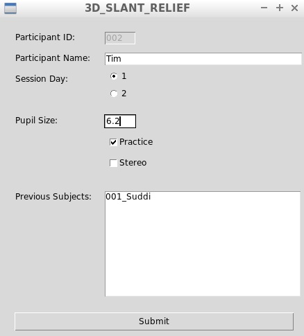
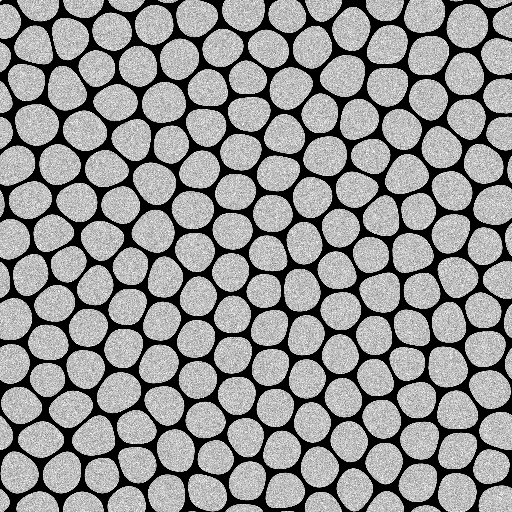
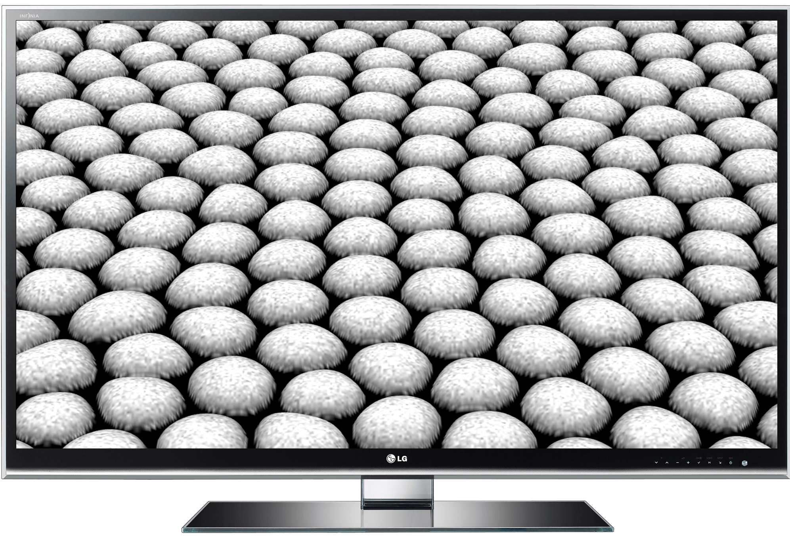

# 3D Slant Relief

[](https://github.com/suddi/3DSlantRelief/blob/master/LICENSE)

A vision experiment engine in Python and OpenGL 3.3 to measure slant perception on surfaces with varying relief.
Participants would evaluate relief on slanted surfaces with relief rendered from texture and directional lighting.

## Installation

The experiment was created for Windows with Eclipse PyDev.

If not provided, please install the following dependencies not provided by `pip`:

````
Tkinter
````

All other dependencies can be installed with `pip`:

````sh
pip install -r requirements.txt
````

## Usage

The experiment can operate in 2 modes:

- `STIMULI_ONLY = True`
    - This will not collect any participant data, it will only render a randomized variation of the stimuli
- `STIMULI_ONLY = False`
    - This will run the experiment collecting participant data.

## Demo

When launching the experiment under the condition `STIMULI_ONLY = False`, it will open the Tkinter input window:



Once the engine has the participant data necessary, it will render the textured surfaces, see below for example of initial and rendered surfaces:

 
